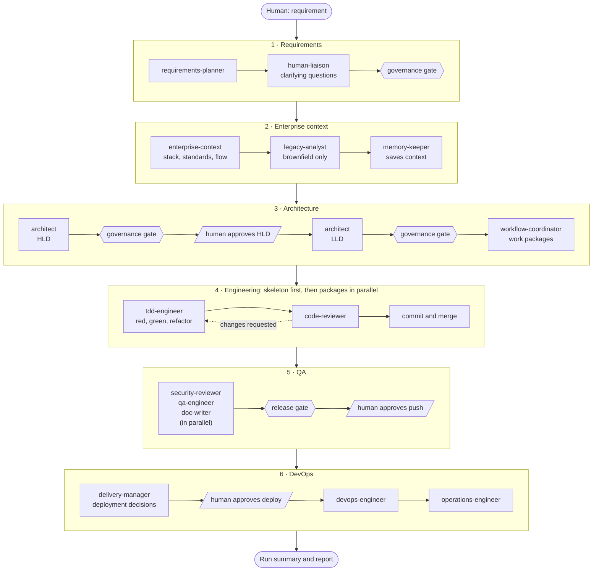
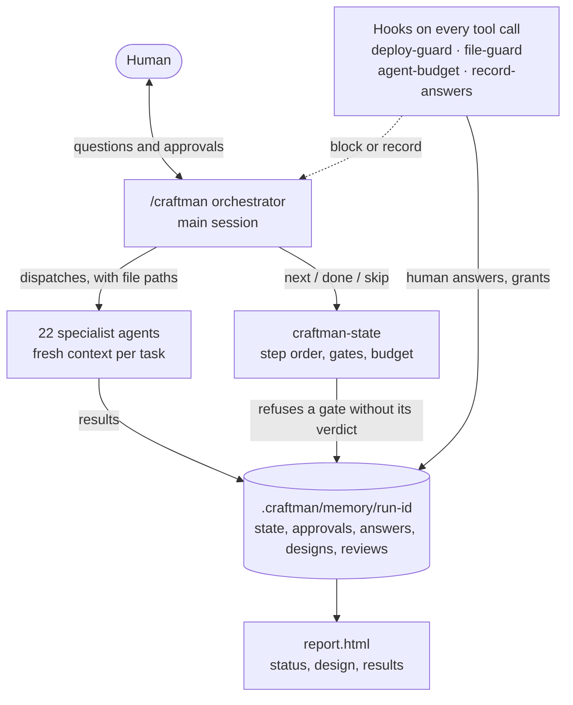

<p align="center">
  
</p>

<h1 align="center">AI-Craftman</h1>

An AI-SDLC plugin for Claude Code. One command takes a requirement through six stages. An orchestration layer runs the pipeline, 22 specialist agents do the work, every outcome is written to project memory, and approvals are **enforced by hooks**, not just requested in prompts.



Hexagons are governance gates and slanted boxes are human approvals. Both are enforced: the pipeline cannot move past one without its passing verdict or your recorded answer.

## Install

```
/plugin marketplace add suraj-singh-sde/ai-craftman
/plugin install ai-craftman@ai-craftman
```

Requirements:
- `python3` (hooks that record human answers and guard memory)
- `git`
- optional: `gh` for PRs and issues

## Commands

| Command | What it does |
|---|---|
| `/ai-craftman:craftman-init` | Creates `.craftman/` with governance policy, enterprise context and sources templates |
| `/ai-craftman:craftman [flags] <requirement>` | Runs the pipeline |
| `/ai-craftman:craftman-status [run-id]` | Lists runs, or one run's steps, approvals, budget and escalations |
| `/ai-craftman:craftman-resume <run-id>` | Continues an interrupted run from its last completed step |

Flags for `craftman`:
- `--profile full|lite`: without the flag, small changes run `lite` and medium or large ones run `full`. `lite` skips the requirements governance gate, architecture approval, the separate LLD pass (one combined design instead), work-package split, tracker issues and the separate security review (the code reviewer does a security-focused review instead)
- `--from STAGE` / `--to STAGE`: stages are `requirements context architecture engineering qa devops`
- `--skip-deploy`
- `--lead` (experimental): one `package-lead` agent runs each work package (build, check, review, fix, commit) and reports once, instead of the orchestrator handling every step. The main session stays small and cheap, which matters because it runs on your session's model. Not yet proven on a full run

```
/ai-craftman:craftman Add password reset via email to the user service
/ai-craftman:craftman --profile lite --skip-deploy docs/requirements/export-csv.md
/ai-craftman:craftman --from qa --to qa Re-verify release 2.3 against its acceptance criteria
```

## Flow

1. **Requirements.** **requirements-planner** writes FRs, NFRs and acceptance criteria. **human-liaison** asks clarifications. **governance** gate.
2. **Enterprise context.** **enterprise-context** reads this repo, `.craftman/context/` and the other repos, docs, Jira and Confluence listed in `sources.md` (through any MCP servers you have connected).
   - It detects the stack and either finds the existing flow or designs a new one.
   - Brownfield code gets **legacy-analyst**.
   - **memory-keeper** saves the flow under `context/flows/` for future runs.
3. **Architecture: HLD, then LLD.**
   - **HLD**: **architect** decides components, data stores, integrations, libraries and the key ADRs. A **governance** gate and a **human-oversight** gate (risk-based) follow, so you approve the big decisions before any detail is written.
   - **LLD**: a fresh **architect** turns the approved HLD into the project structure, interfaces and schemas, error model, data model, and every limit and setting. A **governance** `design` gate checks it against the HLD and the standards. Changing an HLD decision needs a new approval.
   - The lite profile writes one short combined design instead.
   - **workflow-coordinator** splits the work into packages across teams and systems, and optionally creates GitHub or Jira issues.
4. **Engineering.** Work happens on branch `craftman/<run-id>`. A skeleton package (structure, wiring, error model, schema, interfaces) comes first; the feature slices then run **in parallel** in git worktrees. Each package goes through:
   - by default: **tdd-engineer** writes failing tests, records the red run, then writes the code and refactors, in one context
   - security-sensitive packages (the ones that implement auth, crypto, payments or data deletion): **test-writer** (red, re-run by the orchestrator to confirm), then **code-writer** (green, refactor), with test files locked against the code-writer
   - **code-reviewer**: one full pass over tests and code. Only critical and high findings get a fix round, and the re-review only verifies those fixes. Medium and low findings from all packages are fixed in one cleanup pass at the end
   - **code-optimizer**: only when a performance requirement or finding exists
   - one commit per package; lint, typecheck and the full suite run after each group's merges

   While iterating, agents run only the package's tests with a fast command (fail fast, parallel, slow tests excluded). Engineering agents never stop to ask questions: they record assumptions, which go into the summary and the PR. A work plan has at most 1, 3 or 5 packages for small, medium or large changes. **security-reviewer** does threat modelling and an OWASP review, in parallel with QA and docs.
5. **QA.**
   - **qa-engineer** runs the full suite, lint, typecheck and dependency audit, and adds integration, edge-case and end-to-end tests. It also flips a few critical lines by hand to confirm the tests catch the change (mutation testing), and checks every acceptance criterion.
   - **doc-writer** updates the README, API docs, changelog and ADRs.
   - **governance** release gate.
   - PR opened after `[APPROVAL:git-push]`.
6. **DevOps and operations.**
   - **delivery-manager** decides SKIP, ASK or DEPLOY. Every deployment detail is asked separately, with options and a recommended one.
   - `[APPROVAL:deploy]`.
   - **devops-engineer** writes the pipelines, infrastructure-as-code and runbook.
   - **operations-engineer** sets up SLOs, alerts, post-deploy checks and the incident runbook.

Any agent can tag an open question `[research]` when documentation or the web can answer it (a library API, the current version, a standard, a known issue). The orchestrator sends those to **research-agent**, which searches the web, checks the primary source and writes cited answers to `research/<step>.md`, instead of asking you. Earlier answers are reused across runs. Whatever it can't settle goes to you as a normal question.

## Run report (UI)

Every run has a live page at `.craftman/memory/<run-id>/report.html`. Open it in a browser:
- **Status**: progress, next step, agent calls against the budget, every step with its duration, the slowest steps, approvals, answers and escalations
- **Design**: the diagrams first, then the documents. Every HLD and LLD carries mermaid diagrams (HLD: block diagram and main flow; LLD: modules by layer, data model, main operations), and the tab opens with them drawn, each under the heading it explains. The governance, oversight and work-plan results follow
- **Results**: package reviews, security, QA, docs, release gate, research and the summary, each with its verdict

The run opens the page in your browser as soon as the HLD is written, so you approve a design you can see. `craftman-state` rebuilds it after every step; an open page reloads itself when that happens and keeps your tab, scroll position and open documents. `craftman-state report [--open] [run-id]` rebuilds it on demand. A diagram that cannot be drawn is shown as its source with the reason. It is read-only: approvals stay in the terminal, where the hooks check them. Markdown and diagrams render with marked, DOMPurify and mermaid from jsDelivr (pinned versions, with integrity hashes). Offline, documents show as plain text. Agent output is sanitized before it is shown.

## How the parts fit



The orchestrator never does stage work itself. It dispatches an agent, hands it file paths, and records the step in `craftman-state`. Agents write their results to the run's memory folder, which is also what the report reads.

## Agents

| Role | Agent |
|---|---|
| Orchestration layer | `/craftman` command (main session) + `craftman-state` |
| Memory | agents write their own files; `memory-keeper` curates context and summaries |
| Human communication (only agent that talks to humans) | `human-liaison` |
| Shared enterprise context | `enterprise-context`, `legacy-analyst` |
| Governance frameworks | `governance`, `security-reviewer` |
| Human oversight | `human-oversight` |
| Delivery enterprise | `delivery-manager` |
| Workflow coordination across teams and systems | `workflow-coordinator` |
| Research (web references, on demand) | `research-agent` |
| Package lead (opt-in, `--lead`) | `package-lead` |
| Stage specialists | `requirements-planner`, `architect`, `tdd-engineer`, `test-writer`, `code-writer`, `code-optimizer`, `code-reviewer`, `qa-engineer`, `doc-writer`, `devops-engineer`, `operations-engineer` |

The orchestration layer is a command rather than an agent because only the main session can talk to the user. For the same reason, `human-liaison` writes the questions and the orchestrator relays them word for word.

## Skills

Engineering agents preload these skills (`skills:` in their frontmatter), and you can invoke them yourself as `/ai-craftman:<name>`:

| Skill | What it adds | Preloaded by |
|---|---|---|
| `karpathy-guidelines` | Think before coding, simplicity first, surgical changes, goal-driven execution. From [andrej-karpathy-skills](https://github.com/multica-ai/andrej-karpathy-skills) (MIT). | architect, tdd-engineer, test-writer, code-writer, code-optimizer, code-reviewer |
| `handoff-check` | Before returning work: prove tests, lint and typecheck are green, read the diff once as the reviewer (failure paths, cleanup, concurrency, secrets, design), and check that each test can fail for the right reason. Built from the blocking findings of real runs. | tdd-engineer, test-writer, code-writer |
| `root-cause-debugging` | Reproduce, explain, fix once where every caller routes through; never weaken a test or rerun a flaky one until it passes; stop after three failed fixes. | tdd-engineer, test-writer, code-writer, code-optimizer, qa-engineer |

## Engineering standards

`templates/standards/` defines what "production grade" means, and architects, code-writers and reviewers all work from it:
- `general.md`: layering, error model, logging, config, API design, clean code, tests, review severity rubric
- stack files: `python`, `javascript`, `go`, `java`, each with a folder layout, preferred libraries and rules

For a new service, **enterprise-context** writes a project blueprint from them and **architect** fixes the folder structure and error model before any code is written. The reviewer treats these as blocking (high severity):
- layer violations
- hand-rolled replacements for framework built-ins
- swallowed errors or broad catches
- lint or typecheck failures

## What is enforced (hooks), not just prompted

These apply only while a run is active (`.craftman/active-run` exists), so the plugin never interferes with normal work.

| Guard | Hook |
|---|---|
| Deploy, destroy, publish, `git push`, `gh pr create` and tracker commands are blocked until the human answers `Approve` to an `[APPROVAL:<category>]` question | `PreToolUse(Bash)` deploy-guard |
| A push approval covers a plain push only: forced pushes, remote branch deletes, `--mirror` and `--prune` need their own `[APPROVAL:force-push]`, which an infrastructure `destroy` approval does not cover either | deploy-guard |
| A gate (`gov-*`, `approve-*`, `security-review`, `qa`) can be marked done only when its result file shows the passing verdict or the human's grant is recorded; the newest result decides, and skipping or overriding one needs the human's waiver for that gate (`[APPROVAL:waiver-<gate>]`) | `craftman-state` |
| Switching a run to `lite` (which skips gates) is allowed only for a change sized `small`, before any design, and never against a `--profile` the human chose | `craftman-state` |
| Engineering agents cannot be dispatched while the architecture gates are pending: no code before the approved design | `PreToolUse(Agent)` agent-budget |
| The HLD and LLD are done only with mermaid diagrams that will render (unquoted labels with brackets and `;` in sequence messages are refused) | `craftman-state` |
| Every human answer is logged with who and when; approvals become grants | `PostToolUse(AskUserQuestion)` record-answers |
| `state.md`, `approvals.md`, `answers.md` cannot be edited by the model, and `.craftman/` cannot be deleted or moved (`rm`, `mv`, `find -delete`, `git clean -x`) | deploy-guard + file-guard |
| Secrets cannot be written into `.craftman/` | `PreToolUse(Write/Edit)` file-guard |
| `code-writer` / `code-optimizer` cannot edit test files | file-guard (by `agent_type`) |
| Agent dispatch budget per run; extending it needs `[APPROVAL:budget]` | `PreToolUse(Agent)` agent-budget |

The guards match command text. They stop an agent that skips an approval or takes a shortcut; they are not a security sandbox and do not stop one that hides a command on purpose (built from variables, run through `eval` or a script file). A gate's result file is trusted as written, and the orchestrator chooses the run's flags. For hard guarantees, also deny these commands in Claude Code's own permission settings.

**Spin-down.** Whatever a run starts for testing, it stops. Every agent that can run commands must stop the containers, compose stacks, servers and background processes it started before it returns. `craftman-state` records what was already running when the run began, and `craftman-state services` lists what is up now that was not: containers, and processes that reference the project (a hung test run, a dev server). The orchestrator checks it after each engineering group and at the end, stops what the run started, and leaves everything else alone. `craftman-state finish` prints anything still up.

## Settings

Set when enabling the plugin (`userConfig`):
- `model_tier`:
  - `economy`: opus agents run on sonnet
  - `balanced` (default)
  - `max`: sonnet agents run on opus
- `max_agent_calls` (default 60): agent dispatches per run before the human must approve more

Every agent pins its own model and reasoning effort (`effort: high` for the agents that design, build and judge, `medium` for routine ones, `low` for the three haiku agents), so a run does not get slower when your session default is a higher effort. The orchestrator itself runs on your session's model and effort, and it makes a few hundred calls per run: start the run from a session on a fast model (`/model`) at `/effort high` or lower.

Per project, `.craftman/governance.md` sets:
- `autonomy`:
  - `low`: approve every gate
  - `medium`: risk-based
  - `high`: approve only deploy, push, destroy and waivers
- coverage threshold
- review loop limit
- `tracker`: `none` (default), `github` or `jira`. With `none`, the run never asks about tracker issues
- licenses and policies

When a run needs you (a question, an approval, an escalation such as "Docker is down"), you get a desktop notification on macOS and Linux, so a waiting pipeline is not left unnoticed. Set `CRAFTMAN_NOTIFY=off` in your environment to switch off the notifications and the automatic opening of the report.

## Memory layout (in your project)

```
.craftman/
  governance.md               # your policies
  active-run                  # present while a run is in progress
  context/enterprise.md       # services, standards, commands, stack
  context/sources.md          # other repos, docs, Jira/Confluence spaces
  context/flows/<flow>.md     # reused by future runs
  memory/index.md             # all runs
  memory/<run-id>/
    state.md                  # step checklist, budget, branch (craftman-state only)
    approvals.md answers.md escalations.md
    01-requirements.md … 16-operations.md, eng/<WP>/1-4*.md, eng/cleanup.md, research/<step>.md, 17-summary.md
  worktrees/                  # temporary, git-ignored
```

Every memory file starts with a YAML header (`agent`, `status`, `verdict`, `open_questions`, `next`), so results can be read by scripts.

## Cost and time

A package costs about 2 agent calls when review passes first time (tdd-engineer and reviewer); a security-sensitive one costs 3. A **lite** run on a small change is roughly 8–12 agent calls. A **full** run with 3 packages and deployment is roughly 20–30 agent calls.

Wall-clock time is kept down by running independent work together: the slices after the skeleton, context memory alongside architecture, and security, QA and docs together. `state.md` records how long each step took and the total run time, and the summary names the three slowest steps. Use `/cost` for spend, `model_tier: economy` to cut it, and Claude Code's `/fast` mode for faster opus output.

## Try it

`examples/sample-app` is a tiny URL shortener with tests. Copy it somewhere, `git init`, and run the example in its README.

## Development

```
claude plugin validate .
tests/run.sh                                  # state machine + hooks self-check, no API calls
claude plugin eval . --tag smoke --scaffold --allow-tools Bash Write Edit --trust-plugin
claude plugin eval . --tag slow  --scaffold --allow-tools Bash Write Edit --trust-plugin   # full TDD run, paid
```

CI (`.github/workflows/ci.yml`):
- Every push and PR: validate, shellcheck, the self-check and the sample tests.
- `main` and manual runs: the smoke evals. They need the `ANTHROPIC_API_KEY` secret.

## Troubleshooting

- **"blocked … needs human approval"**: working as intended. Answer the `[APPROVAL:…]` question. Check `approvals.md` with `/ai-craftman:craftman-status`.
- **Approvals never take effect**: `python3` is missing, so answers are not recorded. Install it and re-ask.
- **`craftman-state: command not found`**: the plugin's `bin/` is not on PATH in your environment. The command falls back to `${CLAUDE_PLUGIN_ROOT}/bin/craftman-state`.
- **Stale active run blocks pushes in normal work**: run `/ai-craftman:craftman-resume <id>`, or finish it with `craftman-state finish aborted`.
- **Budget reached**: approve the `[APPROVAL:budget]` question (raises the limit by 50%), or raise `max_agent_calls`.
- **`craftman-state: <gate> needs 'verdict: PASS'`** or **"Engineering agents cannot start…"**: working as intended. The gate has not passed yet. Fix what it found and re-run it, or grant a waiver when asked.
- **"…has diagrams that will not render"**: the message names the file and line. In a flowchart, put the label in double quotes; in a sequence diagram, replace `;` with a comma. The architect fixes it in place.
- **Containers or test processes left after a run**: `craftman-state services <run-id>` lists what the run started and is still up.
- **A design note was refused as a "possible secret"**: the value after `password`, `token`, `secret` or `api_key` looks like a real credential (letters and digits, 8+ characters). Write `<redacted>` instead.

## License

MIT
